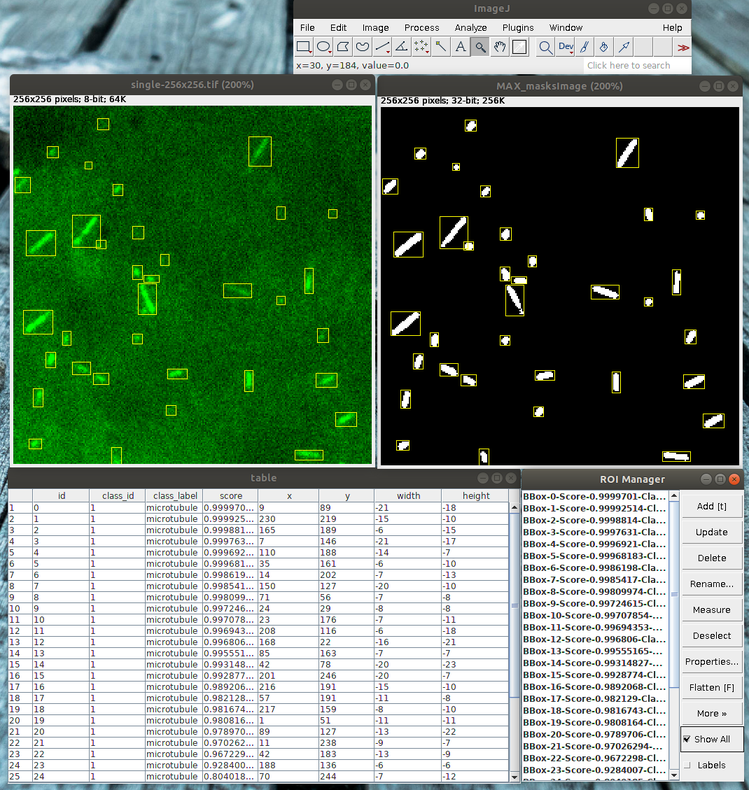

[](https://travis-ci.org/hadim/Fiji_MaskRCNN)

# Fiji_MaskRCNN

A Fiji plugin for [Mask RCNN semantic segmentation](https://arxiv.org/abs/1703.06870).

The trained model is generated using [this Tensorflow implementation](https://github.com/matterport/Mask_RCNN) of Mask RCNN. See [here](training/) about the training part.

If you build a model using this project and you think can be useful to others please contact me. I could add an URL to your model in the Fiji plugin.

## Usage

- [Download the latest JAR here](http://maven.imagej.net/service/local/artifact/maven/redirect?r=releases&g=org.scijava&a=Fiji_MaskRCNN&v=LATEST&e=jar).
- Copy it in the `jars/` folder of your Fiji installation.
- Open an image (2D or 3D).
- Run the plugin with `Plugins > Detection > Mask RCNN Detector`.

- Start [Fiji](https://imagej.net/Fiji/Downloads).
- Click on `Help ▶ Update...`.
- In the new window, click on `Manage update sites`.
- Scroll to find `Fiji_MaskRCNN` in the column `Name`. Click on it.
- Click `Close` and then `Apply changes`.
- Restart Fiji.
- Open your image.
- Then you can start the plugin with `Plugins ► Detection ► Mask RCNN Detector`.

## How it works

The inputs consist of:

- `inputDataset`: An image (only 2D at the moment, stacks would be allowed in the future).

- `modelURL` or `modelPath`: A model as a ZIP file (can be a filepath or an URL). The file contains:

    - `model.pb`: The Mask RCNN graph used for object detection. 
    - `preprocessing_graph.pb`: The graph performing preprocessing on the input image.
    - `postprocessing_graph.pb`: The graph that rescale the outputs of the Mask RCNN prediction.
    - `parameters.yml`: A YAML file that contain hyper-parameters of the model such as label names and maximum image size.
    
The outputs consist of:

- `roisList`: A list of Imagej1 `Roi` (the RoiManager is also populated). Each roi contains its class id and score in its name.
- `table`: A table containing the coordinates of the bounding boxes of detected objects as well as its score and class label.
- `masksImage`: An image mask.

## Scripting

Here is an example script:

```python
# @Dataset data
# @CommandService cs
# @ModuleService ms

from sc.fiji.maskrcnn import ObjectsDetector

modelURL = "https://github.com/hadim/Fiji_MaskRCNN/releases/download/Fiji-MaskRCNN-0.3.3/tf_model_coco_512_new.zip";

inputs = {"modelURL": modelURL,
          "modelPath": None,
          "modelNameToUse": None,
          "inputDataset": data}
module = ms.waitFor(cs.run(ObjectsDetector, True, inputs))

rois = module.getOutput("roisList")
table = module.getOutput("table")
masks = module.getOutput("masksImage")
```

## Available Models

| Objects | Version | Description | URL |
| --- | --- | --- | --- |
| Microtubules | 1.0 | Trained with an articially generated dataset. | https://github.com/hadim/Fiji_MaskRCNN/releases/download/Fiji_MaskRCNN-0.3.3/tf_model_coco_512_new.zip

## Screenshots



## Authors

`Fiji_MaskRCNN` has been created by [Hadrien Mary](mailto:hadrien.mary@gmail.com).

## License

MIT. See [LICENSE.txt](LICENSE.txt)