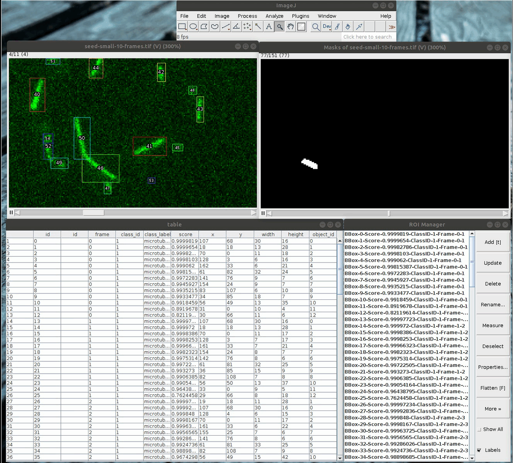

[](https://travis-ci.org/hadim/Fiji_MaskRCNN)

# Fiji_MaskRCNN

A Fiji plugin for [Mask RCNN semantic segmentation](https://arxiv.org/abs/1703.06870).

The trained model is generated using [this Tensorflow implementation](https://github.com/matterport/Mask_RCNN) of Mask RCNN. See [here](training/) about the training part.

If you build a model using this project and you think can be useful to others please contact me. I could add an URL to your model in the Fiji plugin.

Note that you can also run the prediction from pure Python with [this notebook](./training/Notebooks/7_Prediction.ipynb).

## Usage

- Start [Fiji](https://imagej.net/Fiji/Downloads).
- Click on `Help ▶ Update...`.
- In the new window, click on `Manage update sites`.
- Scroll to find `Fiji_MaskRCNN` in the column `Name`. Click on it.
- Click `Close` and then `Apply changes`.
- Restart Fiji.
- Open your image.
- The commands of the plugin are located at `Plugins ► Mask RCNN`.

## How it works

The inputs consist of:

- `dataset`: An image that can be 2D or 3D.

- `model`: A model as a ZIP file (can be a filepath or an URL). The file contains:

    - `model.pb`: The Mask RCNN graph used for object detection. 
    - `preprocessing_graph.pb`: The graph performing preprocessing on the input image.
    - `postprocessing_graph.pb`: The graph that rescale the outputs of the Mask RCNN prediction.
    - `parameters.yml`: A YAML file that contain hyper-parameters of the model such as label names and maximum image size.
    
- `fillROIManager`: Fill the ROI Manager with the detected bounding boxes.

The outputs consist of:

- `table`: A table containing the coordinates of the bounding boxes of detected objects as well as its score and class label.
- `masks`: An image mask.

## Screenshots



## Scripting

Here is an example script:

```python
# @Dataset data
# @CommandService cs
# @ModuleService ms

from sc.fiji.maskrcnn import ObjectsDetector

inputs = {"model": None,
          "modelName": "Microtubule",
          "dataset": data,
          "fillROIManager": True}}
module = ms.waitFor(cs.run(ObjectsDetector, True, inputs))

table = module.getOutput("table")
masks = module.getOutput("masks")
```

The plugin also comes with an object tracker based on the centroid of the detected masks:

```python
# @Dataset data
# @CommandService cs
# @ModuleService ms

from sc.fiji.maskrcnn import ObjectsDetector
from sc.fiji.maskrcnn import ObjectsTracker

inputs = {"model": None,
          "modelName": "Microtubule",
          "dataset": data,
          "fillROIManager": True}
module = ms.waitFor(cs.run(ObjectsDetector, True, inputs))

table = module.getOutput("table")
masks = module.getOutput("masks")

inputs = {"masks": masks,
          "table": table,
          "linkingMaxDistance": 10,
          "gapClosingMaxDistance": 10,
          "maxFrameGap": 5,
          "fillROIManager": True}
          
module = ms.waitFor(cs.run(ObjectsTracker, True, inputs))
table = module.getOutput("resultTable")

```

There is also a command that combine both detection and tracking:

```python
# @Dataset data
# @CommandService cs
# @ModuleService ms

from sc.fiji.maskrcnn import ObjectsDetectAndTrack

inputs = {"model": None,
          "modelName": "Microtubule",
          "dataset": data,
          "linkingMaxDistance": 10,
          "gapClosingMaxDistance": 10,
          "maxFrameGap": 5,
          "fillROIManager": True}
module = ms.waitFor(cs.run(ObjectsDetectAndTrack, True, inputs))

table = module.getOutput("resultsTable")
masks = module.getOutput("masks")

```

## Available Models

| Objects | Version | Description | Size | URL |
| --- | --- | --- | --- | --- |
| Microtubules | 1.0 | Trained with an articially generated dataset. | 512x512 | [Link](https://github.com/hadim/Fiji_MaskRCNN/releases/download/Fiji_MaskRCNN-0.4.0/tf_model_microtubule_coco_512.zip)

## GPU Support

This type of neural networks are much more faster on GPU than CPU. See the following benchmark where the detector has been run on one image. Note that the size does not matter since the images are padded to the size of the network during preprocessing.

*Test done with `Fiji_MaskRCNN-0.4.8`.*

|Model | Version | Device Type | Device | Platform | Detection of Duration (s) |
| --- | --- | --- | --- | --- | --- |
Microtubule | 1.0 | GPU | GeForce GTX 1050 Ti 4 GB | Linux | **2-3** |
Microtubule | 1.0 | CPU | Intel i7-7700HQ 2.80GHz 8 cores 16 GB | Linux | **10-11** |

To enable GPU support ([only Linux at the moment](https://github.com/tensorflow/tensorflow/issues/16660)), you need to manually remove `libtensorflow_jni-1.8.0.jar` from the `jars` folder in your Fiji folder and copy [`libtensorflow_jni_gpu-1.8.0.jar`](http://central.maven.org/maven2/org/tensorflow/libtensorflow_jni_gpu/1.8.0/libtensorflow_jni_gpu-1.8.0.jar) instead.

## Authors

`Fiji_MaskRCNN` has been created by [Hadrien Mary](mailto:hadrien.mary@gmail.com).

## License

MIT. See [LICENSE.txt](LICENSE.txt)